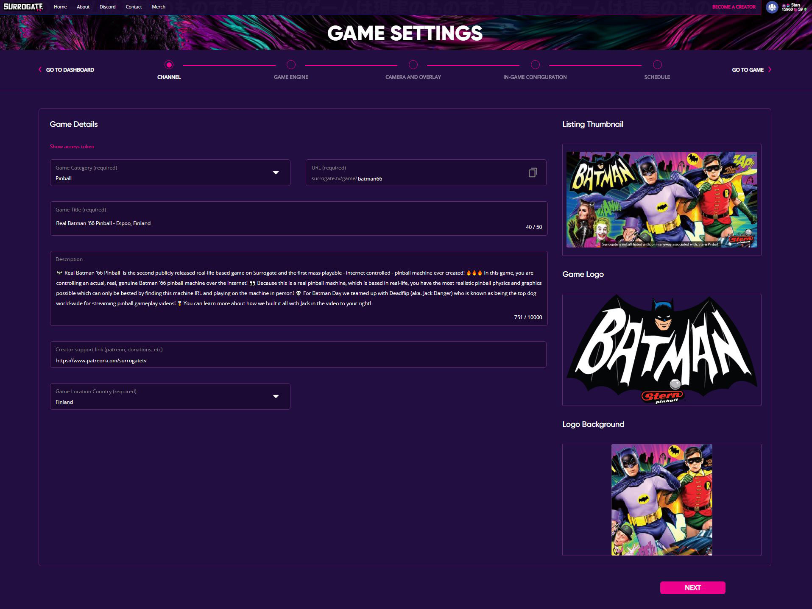
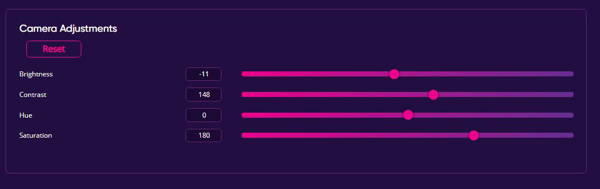
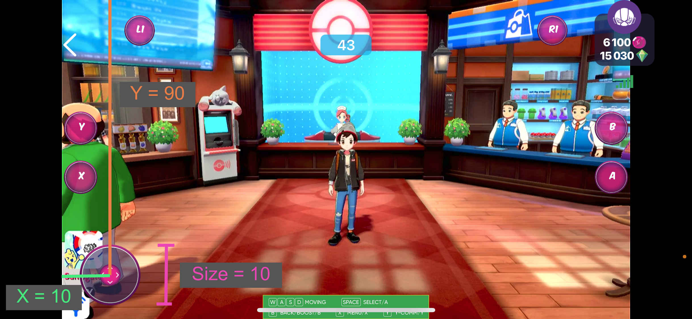
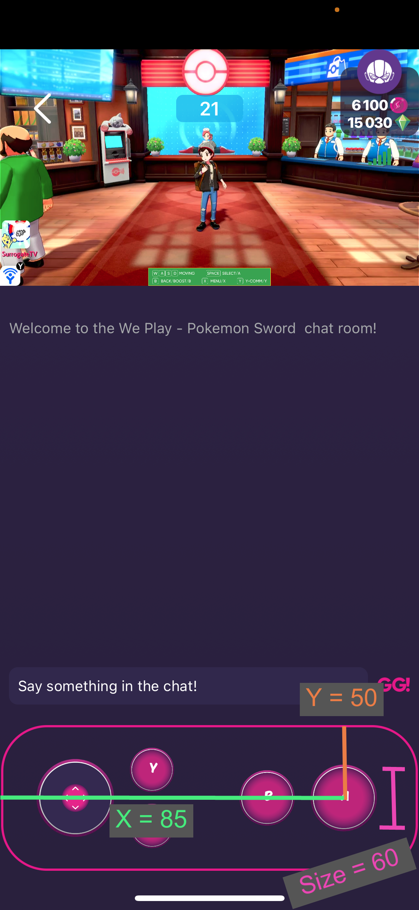

# Game Settings

This document explains how to use and configure the game settings, which can
be found at the bottom left of the dashboard page. The settings pages allow
the game creator to configure the game, as well as the looks and the experience
of the game page, such as:

- Channel visuals and information
- Game engine settings
- Camera and Overlays
- Controls
- Game Schedule

## Channel

The channel section allows the creator to customize the look of the game page
as well as how the players will see it when browsing the games on the front
page and category pages.

Here’s an example Channel Page from Surrogate’s Batman’66 game page:

### Text elements

- **Game Category** - allows selecting a certain category for players
  to find the game more easily. If your game doesn’t fit any category, please contact
  support.

- **URL** - enables entering a custom game link.

- **Game Title** - the title of the game.

- **Description** - a text block that appears under the game stream
  which gives more information about the game.

- **Creator Support Link** - allows to add a support link for the
  creator, can be any link.

#### Graphical elements

- **Listing Thumbnail** - the graphic that appears on the front page
  and category pages to attract the player. Recommended resolution: 601 x 301 pixels.

- **Game Logo** - the logo of the game page, appears on the top-right
  of the game page. Recommended resolution: 986 x 293 pixels.

- **Logo Background** - a visual that appears behind the game page
  logo. Recommended resolution: 320 x 352 pixels.

### Game Engine

Every time a user creates a new game on surrogate.tv and presses the
`Start game engine` button on the dashboard, a game-specific game engine is created.
This game engine is responsible for handling the player queue and allows players
to connect and control the game robots.

#### Game Engine Settings

- **Pause game engine** - allows pausing the game engine, this prevents
  the next game loop from starting. Does not pause the currently active game, either
  END state has to be reached, or `RESTART` button has to be pressed on the dashboard.

- **Minimum Amount of Players** - allows setting how many players
  should be in the game for it to start. For example, a robot fighting game like
  SumoBots requires at least 2 players to be in the game, otherwise, it will be
  an instant victory for the only player in the game.

- **Minimum waiting for players time** - allows setting for how
  long the game engine will wait for additional players to join the queue if
  there are still available robot seats. By default, there’s a 30 second wait time.

- **Max ready check time** - allows enabling the ready check.
  By default this feature is disabled, but if the game creator wants to make
  sure that the players are ready to play the game, they can set a ready check timer.
  Once set, a ready check will pop up when it’s the player’s turn to play the game.
  If the player confirms the presence they are moved into the game, but if not,
  the next player in the queue will be taken instead.

- **Min length for the preGame phase** - this field allows defining
  the minimum time of the on_pre_game() state of the robot. In Batman’66 pinball,
  this feature is used to wait for the intro video to finish before starting the
  game. When the timer runs out and every seat has finished on_pre_game(), the game
  will move to the on_countdown() state. See the [Game states section](game_loop)
  for more information.

- **Max length for the preGame phase** - this field allows defining
  the maximum time of the on_pre_game() state of the robot. In some games like
  Race Real Cars 1:43, this feature is used for the players to have time to drive
  to the starting line of the game. See the [Game states section](game_loop) for
  more information.

- **Countdown time** - allows having a countdown for the player before
  the game starts, and to choose how many seconds it should be.

- **Max game length** - allows defining the maximum time of the state
  when the game is actually playable (on_start() method). This is used in cases when
  the game robots might be in a state where there is no trigger to move to the
  on_exit() method. For example, if in SumoBots two players aren’t fighting against
  each other and are standing in the centerpiece, the game will never end, unless
  there’s a max game length timer.

- **Pairing type** - allows defining how the robots are allocated
  to the players:

    - **Full random** - If the pairing type is set to full random,
      players get allocated to the robots in random order.

    - **Robot seat order** - If set to by robot seat order, players
      will receive their robots based on the “Seat” order. For example,
      there is a 3 car racing game, in the robot configuration the red
      car has seat 0, the green car has seat 1, and the yellow car has
      seat 2. 2 players queue up for the game.
      The player who queued first will always get the red car,
      and the player who queued second will always get the green car.
      The yellow car will never be used in a 2 player game.

**Note:** If you’d like to enable a robot selection menu (player
can choose a specific robot to control), please contact support.

### Robot Configuration

The robot configuration settings allow adding additional Robots to the game.
Each robot can be controlled by one player at a time and represents one queue
seat for the game. Each robot has it’s own identifiers which define how and
when is it operable:

- **Controller** - a unique identifier of the robot’s controller,
  which the player is controlling (has to match the ID defined in the robot's
  srtg.toml file).

- **Streamer** - an identifier for the video feed of the robot.
  **Note:** the same streamer can be used for many robots. For example,
  in a top-down game like SumoBots, there is just one camera feed for all the robots.

- **Queue Option ID** - a name for the robot which is shown to the
  players. With this you can choose a nicer name to be shown, instead of something
  like car-1 (currently only used when specific robot selection is enabled).

- **Seat** - an identifier for the robot’s seat. Each robot has to
  have a unique seat number in their set. The robot with the smaller seat number
  will always have priority when using the “robot seat order” game pairing type.

- **Set** - an identifier for the robot's set. Sets can be used to
  put the robots in groups. This is a very valuable feature in games where the goal
  is to have the game running as long as possible but the robots can only be online
  for a certain amount of time (when the battery needs a recharge). Example: In the
  SumoBots game, we have 2 sets. When one set is charging, the other set is used
  for playing. By switching the sets, we are able to run the game continuously,
  without having the issue of waiting for the batteries to recharge.

- **Enabled** - allows to enable or disable the robot. This is a very
  useful feature when one of the robots starts malfunctioning. For example in SumoBots,
  when one of the Robots stops working as intended, it gets disabled, and then it
  is still possible to continue the session. When the robot is disabled, it will
  be counted out of the game, and no player will get control of it, but the game
  loop can still continue as long as there are enough robots for the minimum amount
  of players rule is followed. The same function is also available in the
  Game’s Dashboard.

## Camera and Overlay

The camera and overlay page allows tuning the in-game visual experience for
the players.

### Camera Adjustments

If the robot’s video capture device (capture card, web camera, etc.) supports software
adjustments of the picture, it is possible to configure them directly from the
Camera Adjustments section of the page. To do so, preview the video feed of a specific
robot and the settings will appear:

These settings will automatically take effect on the robot preview screen and can
be always be reset to the default settings by pressing the reset button.

**Note:** currently only UVC compliant camera adjustments are supported
(USB web cameras, capture cards, etc.). Raspberry Pi (CSI) camera support is still
in development.

### Overlays

In the overlays configuration section additional elements can be added to the game
experience on top of the video feed. Here’s what can be added:

- **Current Player List** - shows who is currently in the game.

- **Controller Instructions** - add a visual element showing the
  game controls

- **Show PreGame timer** - shows the pregame timer before the
  countdown starts

- **Show Countdown timer** - shows the countdown timer before
  the game starts

- **Show remaining timer** - shows how much time is left before
  the game ends

- **Hide Scoreboard** - hide the scoreboard which by default gets
  shown at the end of the game.

- **Your turn indicator** - An indicator that is visible during player's
  own turn. Useful in games like a 4-player pinball, which is a turn-based multiplayer.

- **Your turn popup** - A visual pop-up that tells the player that it
  is their turn. This is shown when your turn begings.

- **Overlay image** - allows uploading an overlay image that hides
  unwanted parts of the video feed and adds extra immersiveness to the game. For
  example, in Batman’66 there’s an overlay that hides the areas outside of the playfield.

- **Intro video** - add a pregame video that adds extra immersiveness
  to the experience. For example, in Batman’66 there’s an intro video showcasing
  the game’s playfield.

- **Background Music** - add background audio files to the game.
  These are played both for the people watching and playing.

- The enabled overlay files will automatically appear in the preview video
  feed when added.

**Note:** the maximum file size is 20MB and the total maximum size
of all files is 200 MB.

## In-Game configuration

### Score settings

Use the score settings to change the scoring type of the game.
You need to take the score type into account when sending scores from the robot.
Change score type will also effect the best scores (all time) and
"monthly best" scores on game page. The sort order can be edited to change
the order to descending or ascending.
Here are the different types:

- **Points** - Biggest/Lowest score per user. The robot should sent score as integer.

- **Timestamp** - Best/Worst time per user. The robot should send score as integer
  in milliseconds.

- **ELO** - ELO scoring system where you get more points by winning people who have
  better ELO than you. Robot should send scores 1, 2, 3, 4, ..., n where user with
  score 1 is the winner and score 2 mean second and so on.

- **Total Wins** - Cumulative amount of wins per user. Robot should send score 1
  to mark game as won.

- **Total Games** - Cumulative amount of games per user

**Note:** Changing the score type will reset all previous best and monthly scores.

### Controls

The controls page allows binding the keyboard keys and configuring mobile
control position and size.

The keys in the control settings are automatically fetched from the currently
enabled robot’s game Python file and are shown on the page. For each key, it
is possible to rename the key text (used for mobile buttons), as well as to bind
the key themselves. Each controller function can have multiple key bindings at
the same time. It’s is not required to have each function to have a keybinding,
only the ones that the player has access to.

None of the settings are saved unless the “SAVE” button is pressed.
If you want to revert the changes, just refresh the page.

**Note:** all the enabled robot controllers should have the same key
function classes, otherwise the game will malfunction.

#### Mobile Controls

In mobile the controls are displayed on top of the game stream (in landscape)
or below the stream in portrait. You can control the position and size
of the inputs from the "Mobile Lanscape" and "Mobile Portrait" fields.
The position and size is presented by 3 integers between
0-100 that are separated by comma.
First integer is the x position (left to right) as percentage from the total
control area width.
Second integer is the y position (top to bottom) as percentage from the total
control area height.
Last integer is the total size (diameter) of the input as percentage from the
total control area height.
For e.g.

**Landscape "10, 90, 10"**
Would be in bottom left with size of one tenth of the total control are height.

**Portrait "85, 50, 60"**
Would be in right middle with size bit over half of the control area height.

**Note:** In case of incorrect input the text box will have red edges.

## Schedule

The schedule page allows the game creator to set when the game will be online
and playable. The schedule is shown based on the time zone of the person
accessing the Schedule page.

To add a new timeslot, press the “Add time slot” button, and configure the
session time.

If the game is mostly online and only is stopped for maintenance, it is possible
to set the schedule to 24/7 mode by pressing the `Is this a 24/7 game?` toggle.
This will fill the schedule as always online, and every added time slot will be
counted as a game offline time slot.
