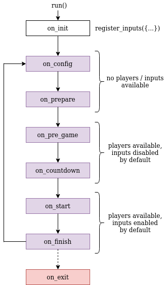

# Game loop

On this page we will explain the different states the python controller goes through
before, during, and after a game. We will also explain the default actions taken
in the different states. After reading this document, you should have a basic understanding
of the game loop. You should also know which actions you must implement yourself,
and the default behavior of the state handlers.

Surrogate.tv's game loop consists of following steps:

All states except on_init and on_exit are the result of a corresponding message
from the game engine (**GE**). In other words, the GE is ultimately
responsible for the transitions between the states. The exceptions to this are
on_init and on_exit, which are called only once at the beginning and end of the
controller program, respectively. The conditions for the state changes are
explained below.

Each state has an internal handler, which is called first, and an optional handler
which can be implemented by the game creator, if necessary. None of the states
are strictly necessary to implement by the creator: the game loop will run without
any of the handlers implemented. However, you should at least register your inputs
at on_init in order to control your game. You can find examples of how to implement
all of the state handlers, in `game_templates` and `games` directories.

Next we will give a more detailed explanation of the different states.

## Game states

### on_init

This method is run once when the program is started.
**You should initialize your inputs here.** (I.e. the input objects, like a joystick
or a switch). You can also do other initializations here, keeping in mind that
this is only run at the start of the program, and not between games.

### on_config

*Can be safely ignored.*

Called always as the first method of the game loop. Used to pass config information
from the admin panel to the controller, and to check that all the controllers are
working. May be called multiple times within one game loop, for example if configuration
keeps changing.

The config is a python dict containing information about the robots configured
in the admin panel: the seat number, id, streamer, enabled/disabled. It also
contains the robot sets configured in the admin panel.

The game loop continues once all robots have answered to \_on_config_handler.

### on_prepare

**All variables should be initialized/reset here, as this gets called once for
every game loop. Use this method to prepare any physical devices you may have
in the game.**

The game engine is looking for players during this state.

Once this state has completed (or admin presses start from the dashboard page)
and enough players have been found from game queue, the game loop moves to on_pre_game.
If you don't want that the game can start without admin action, this handler should
return False, to prevent sending transition message to the game engine.

### on_pre_game

*Can be safely ignored.*

The duration of this state is configured in the admin panel. The state will end
early if self.io.send_pre_game_ready() is called by every seat in the game.

Players are available to the controller in this state. Inputs are still disabled
by default, but they can be enabled to allow players to control the game before
it officially begins.

Intro video can be configured to play during this state from the admin panel.
Note that the intro video can be cut short if preGame min length has not been
set to match the intro video length.

The return value of this method will be set as the self.\_current_seat value
(which is an integer).

### on_countdown

*Can be safely ignored.*

If you wish to do something during the countdown, you may do it here.
The countdown is configured in the admin panel.

### on_start

**Inputs are now enabled by default**. Scores, laps and progress are counted.

This state is where the actual gameplay takes place. It will last until the maximum
game time is reached (set in admin panel), or self.io.send_score is called with
final_score=True or with seat_final_score=True for all seats, or self.io.send_playing_ended()
is called.

Game state updates (i.e. scores, laps) can be sent to the GE through self.io methods.

### on_finish

*Can be safely ignored.*

Called at the beginning of a 15 second grace period, which begins when the
game ends. Players are still connected, and inputs and score counting are still
enabled by default.

**Inputs will be disabled and reset**, and config and player variables will be
reset in the internal \_on_end_handler method **after the grace period ends**
and a 'gameEnded' message is sent by the GE.

### on_exit

*Can be safely ignored.*

Called once before the program exits. You may do cleanup here if needed.
