# Getting started

This document guides you in [installing the SurroRTG SDK](#sdk-installation),
[creating a game instance](#create-a-game-instance-on-surrogate-tv) and running
a [template code](#running-template-game).

To get everything running smoothly you should follow the steps in the order given
here

1. [Create a game on surrogate.tv](#create-a-game-instance-on-surrogate-tv)
2. [Install controller SDK](#sdk-installation)
    1. [Method 1: Premade image](#method-1-installing-a-pre-made-image)
        1. [Downloading and installing the image](#downloading-and-installing-the-image)
        2. [Finding the controller setup page](#finding-the-controller-setup-page)
        3. [Setting up the controller](#setting-up-the-controller)
        4. [Connect to Internet with an Ethernet cable](#connect-to-internet-with-an-ethernet-cable)
        5. [Connect to Internet with wifi](#connect-to-internet-with-wifi)
        6. [After connecting to Internet](#after-connecting-to-internet)
    2. [Method 2: Manual installation](#method-2-manual-installation)
        1. [Setup Raspberry Pi](#setting-up-raspberry-pi)
        2. [Install streamer](#installing-surrogate-streamer)
        3. [Configure your streamer and controller](#configuration-file)
        4. [Test simple game](#running-a-template-game)
        5. [Create systemd unit from controller](#running-the-surrortg-python-sdk-controller-automatically-on-boot)
        6. [Install watcher stream](#installing-surrogate-watcher-stream)

You might need to jump between steps 3-6 in case you missed something so remember
to look around if you run into trouble. Also take a look at the
[troubleshooting page](troubleshooting). There you can also find out how to read
logs and restart the code modules.

## Requirements

To get started with installation and running a sample game, these are the hardware
requirements:

1. [Rasperry Pi](https://www.raspberrypi.org/) single board computer,
  for example model 3B+, 3A, or 4B
2. A 16GB+ micro SD card
3. An SD card reader, either built in to your computer or as an adapter.
4. An official [Raspberry Pi Camera](https://www.raspberrypi.org/products/camera-module-v2/)
   or some USB camera (UVC compliant), check the [support list](camera_support)

## Create a game instance on Surrogate.tv

Your own game can be controlled from the game's dashboard.

To get one, you must first create a new game. Create a new game by going to
[surrogate.tv's game creation page.](https://www.surrogate.tv/admin/create-new-game).
**Note: you must have an account and be logged in to create the game. If the page
says Restricted Access, please contact the Surrogate.tv team, and mention your
creator account username.**

After that is done, choose the name, title, short ID, and category for your game.
All of these can be edited later.

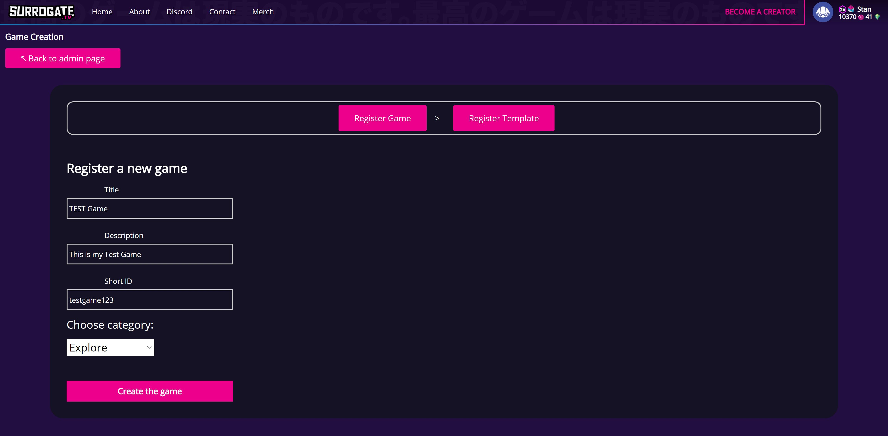

This will create a new Surrogate game, and open up the game dashboard
`www.surrogate.tv/game/<SHORT_ID_YOU_CHOSE>/dashboard`.

The dashboard allows you to analyze the game state, and turn the game online for
other players. See more on the Dashboard and Settings page (link to settings can
be found at the bottom left of the dashboard).

Turn on the Game Engine for the game by pressing the "TURN IT ON" button.

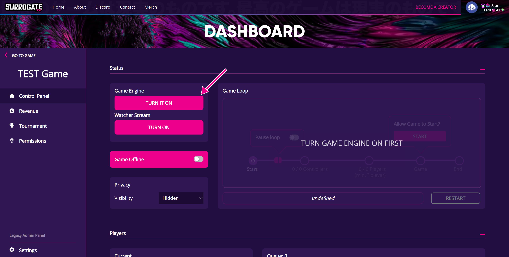

The game engine creation process will take around 3 minutes, but you can already
move to the next step.

At this point, navigate to the Settings page from the bottom left corner
of the web page.

In the settings page, click the "Show access token" text and copy the token
to your clipboard.

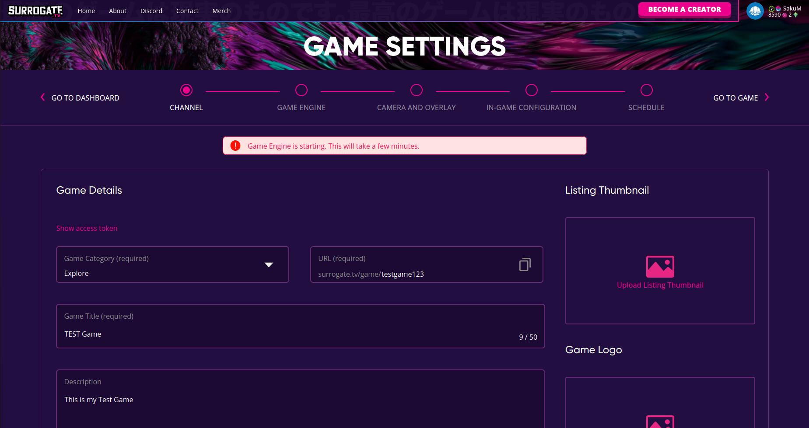

We will get back to the game page configurations and getting the streamer to
work after we have installed the SurroRTG SDK.

**You will need to continue the tutorial to get your streamer and
controller connected to the game.**

## SDK installation

The SDK installation can be done in two different ways:
[Method 1:](#method-1-installing-a-pre-made-image)
flashing a premade image file to an SD card
(recommended)  
[Method 2:](#method-2-manual-installation)
manual installation on top of an existing raspbian image
(for advanced users only)

### Method 1: installing a pre made image

#### Downloading and installing the image

Download the Surrogate custom [image](image-builds/surrogate-raspbian-latest.img).
Note that the image file is large and the download can take a long time,
especially with slow Internet connection.
Once the download is complete, take note of the file name and location.
You might also need to extract the image file from the zip file separately,
but Raspberry Pi Imager should do this automatically for you. We will get back
to this in the next steps.
Next plug an SD card to a slot in your computer or to your card reader in order to
flash the SD card with the image, for which there are several free tools available.
If your operation system is Windows, MacOS or Ubuntu,
you can use [Raspberry Pi Imager](https://www.raspberrypi.org/software/).
Another alternative that supports other Linux distributions is
[BalenaEtcher](https://www.balena.io/etcher/).
Once the flashing is complete, remove the SD card from your
computer and plug it in to the Raspberry Pi.

#### Finding the controller setup page

After plugging the SD card in, you should be able to see a hotspot with ssid
surrogate-rpi in a minute. Connect to the hotspot with the password "surrogatetv".
Note that once you connect to the hotspot you will lose your Internet
connection, unless you're connected to Internet with an Ethernet cable.
Go to the [Controller configuration page](http://192.168.0.1).
If you are using an operating system that supports mDNS, such as Linux or MacOS,
you can also go to [http://surrogate-rpi.local](http://surrogate-rpi.local).
It might also work on some Windows computers.

#### Setting up the controller

Now paste the token you copied previously to the field and click continue.
If the field is outlined with a red color, something has gone wrong
when copying the token.

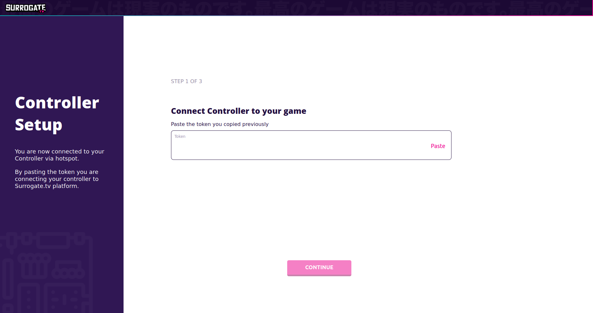

Next, if you want, you can give the controller a unique name.
If you are setting up more than one controller, this step is mandatory,
as all controllers connecting to the game engine must have unique names.
Changing the controller name will also change the hostname of the Raspberry Pi.
If you previously used the mDNS address <http://surrogate-rpi.local>, your
address will change to `http://[controller name].local`, where [controller name]
is the name you chose. We'll go into connecting the controller to a network in the
next steps.

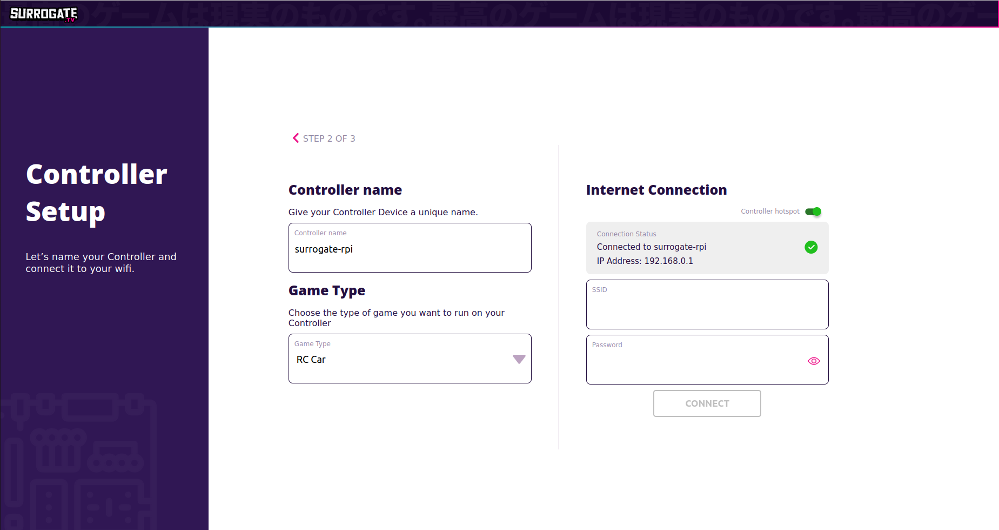

Next, choose the type of game you want the controller to run. You can see a list
of templates that you can choose from. If you want to use your own template,
you'll have to ssh to the Raspberry Pi and do a bit of coding yourself. These
are covered in [Method 2:](#method-2-manual-installation).

Now, you'll have to connect the controller to Internet. There are two ways
to do this: with an Ethernet cable or wifi credentials.

##### Connect to Internet with an Ethernet cable

If you have an Ethernet cable and a port, plug the cable in the Raspberry Pi,
wait for a while and refresh the page. This is what you should see.

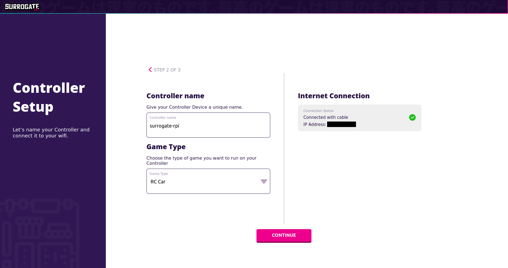

If you don't see this immediately, give it some time and refresh the page
a couple of times.

If you want, you can copy the Ethernet IP address visible in the page
and go to `http://[ip address]` where [ip address] needs to be replaced. This
allows using the page without being connected to the hotspot.

##### Connect to Internet with wifi

If you don't have an Ethernet cable, however, you can type your wifi credentials
(ssid and password) in the "Internet connection" section in the web page, then
press "Connect" and you should see this popup.

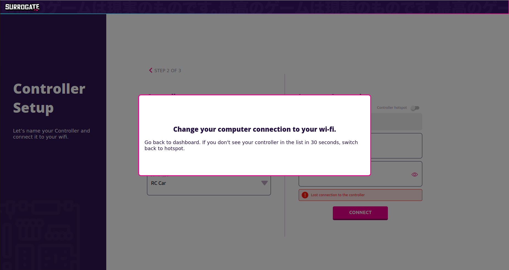

If your controller does not soon appear in the controller list, most likely
something has gone wrong. Another indicator for something going wrong with
connecting to wifi is if the hotspot does not disappear after a while from
your network list. If this is the case, connect to the hotspot again and go
back to the controller setup page. Most likely your wifi is unreachable for
the controller or the credentials were typed incorrectly.

When your controller does appear in the list, you should be able to click the
controller name, which will lead you to the controller setup page again with the
new IP address. If you were using an mDNS address, you don't have to click the
link. The mDNS address will be eventually resolved to the new IP address.

Here's how the dashboard should look like after connecting with wifi.

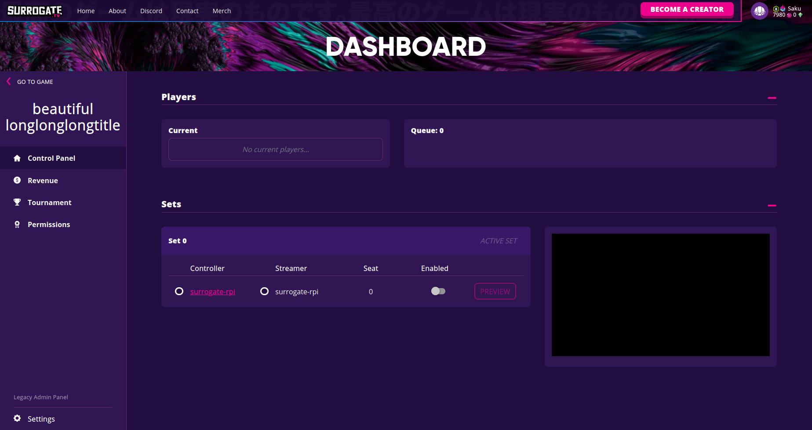

Remember to press the "Enabled" slider. After doing that and if everything
goes well, you should see this.


If either controller or streamer shows a red cross, they've been unable to
connect to game engine. In this case, you should also be able to see errors
described in the next section. Usually the problem is that you've forgotten
to plug in some peripherals to the Raspberry Pi.

##### After connecting to Internet

In the network page, press Continue.

At this point, if everything goes well, you should see this page.

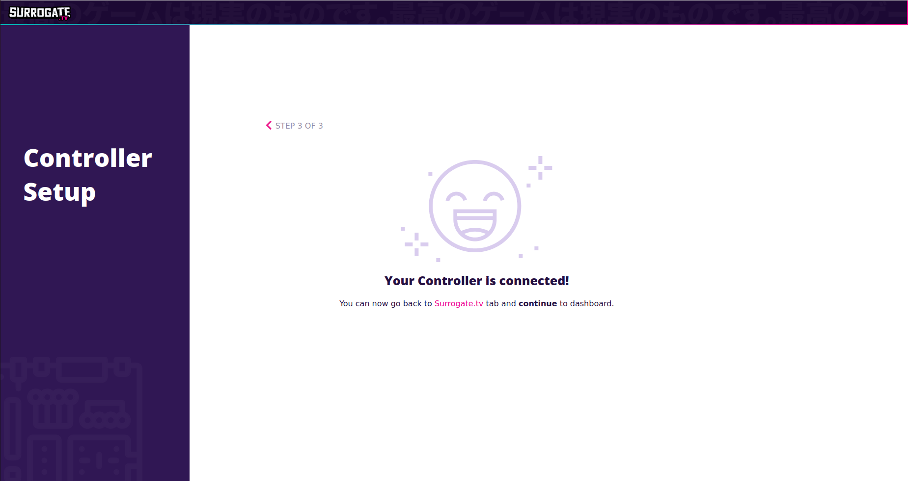

If you have forgotten to connect a camera or some other peripherals required
by the type of game chosen, you will see an error such as this.

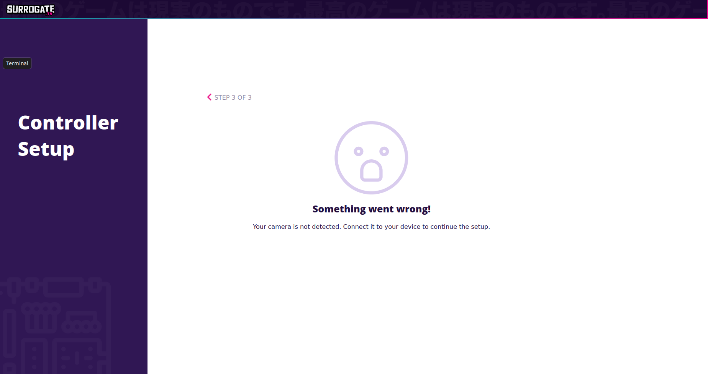

If that is the case, check that all required peripherals are connected and
that the chosen game type is correct.

### Method 2: manual installation

#### Setting up Raspberry Pi

First follow Raspberry Pi's [general setup](https://projects.raspberrypi.org/en/projects/raspberry-pi-setting-up).
**Note: Choose Raspberry Pi OS (other) -> Raspberry Pi OS Lite (32-bit) as the
operating system** to install the official Rasbpian image. We recommend setting
up your internet connection and enabling ssh-connection via sudo raspi-config by
following [raspi-config](https://www.raspberrypi.org/documentation/configuration/raspi-config.md#)
setup. Alternatively, you can do everything on your host computer after flashing
the image to an SD card by following [headless-wifi-setup](https://www.raspberrypi.org/documentation/configuration/wireless/headless.md#)
and [headless-ssh-setup](https://www.raspberrypi.org/documentation/remote-access/ssh/README.md#)
to modify the boot-partition of the SD card with ssh and wpa_supplicant.conf files.

If you are going to use ssh connection to control the raspberry pi, please get
the IP-address of the raspberry pi by running on the raspberry pi terminal

```
ip addr
```

or by some other means (`nmap` tool or similar)

When done, open up the terminal (`ctrl + alt + t`) or connect via ssh to the
raspberry pi and make sure that everything is up to date by running the following
commands

```
sudo apt update

sudo apt full-upgrade

sudo reboot
```

#### Installing Surrogate Controller

First we need to install git and some other dependencies.

```
sudo apt-get install python3-setuptools python3-pip pigpio python3-pigpio git

sudo systemctl enable pigpiod

sudo systemctl daemon-reload

sudo systemctl start pigpiod
```

After this we can clone [the GitHub repository](https://github.com/SurrogateInc/surrortg-sdk).

```
cd <folder you want to download the git folder>
git clone https://github.com/SurrogateInc/surrortg-sdk.git
cd surrortg-sdk
```

Before installing the required python packages, let's make sure we are using the
correct python and pip versions.

```
python --version
```

If this returns "Python 2.7.16" then try running:

```
python3 --version
```

This should return "Python 3.7.X". Our SDK requires Python 3.7 or later to run.
Next, confirm that pip is using the correct version

```
pip3 --version
```

This should return the pip version. The python version that is bound to it should
state "(python 3.7)".

Now that python/python3 and pip/pip3 are using python 3.7 or greater version,
we will install sdk dependencies by running

```
sudo pip3 install -r requirements.txt
```

This will install all required packages that are defined in requirements.txt. If
you later add your own packages, you will need to install them manually by running

```
sudo pip3 install <package>
```

The reason we are installing the python packages as super-user (sudo) is that your
controller code will be running as a systemd unit that is executed as sudo and
thus needs to have the packages installed in the correct location. This will be
later changed to use python virtual environments but at the moment this is the
only approach supported out-of-the-box.

#### Installing Surrogate Streamer

Next we will install Surrogate streamer module and configuration files. The following
commands add our custom repository and its key to your apt-sources and installs
our srtg-streamer apt-package.

```
sudo sh -c 'echo deb https://apt.surrogate.tv/ buster main >> /etc/apt/sources.list'

sudo apt-key adv --keyserver "hkps://keys.openpgp.org" --recv-keys "58278AC826D269F82F1AD74AD7337870E6E07980"

sudo apt-get update

sudo apt install srtg-streamer
```

Now you should have our streamer installed on your raspberry pi. However, it is
not yet running as you haven't configured the settings and started it. You can
see that the installation was successful by checking the status of the streamer
module.

```
sudo systemctl status srtg
```

The streamer will not work yet as it hasn't been [configured](#configuration-file)

**We recommend increasing the memory available to the GPU to make the streaming
experience smoother and more robust.**

`sudo raspi-config` -> `advanced options` -> `memory split` -> 256 (or 512 if your
Pi has 1GB or more RAM available) or by editing `/boot/config.txt` -> `gpu_mem=256`.
Reboot the system after.

#### Configuration file

When you installed the streamer, it added a configuration file to `/etc/srtg/srtg.toml`.
You can edit it with the following commands, or with your favorite text editor.

```
sudo nano /etc/srtg/srtg.toml
```

In the srtg.toml file, give your device a device_id, for example controller-1.
Save this id as you will need to use if for future configuration.

Next you need to copy your controller `token` from `game settings page` to the
configuration file. You can navigate the page by pressing the `Settings` button
on your game dashboard, or by entering the following web address `www.surrogate.tv/game/<SHORT_ID_YOU_CHOSE>/settings`.

Here's an example image to help you find the Controller Token on the game settings
page:

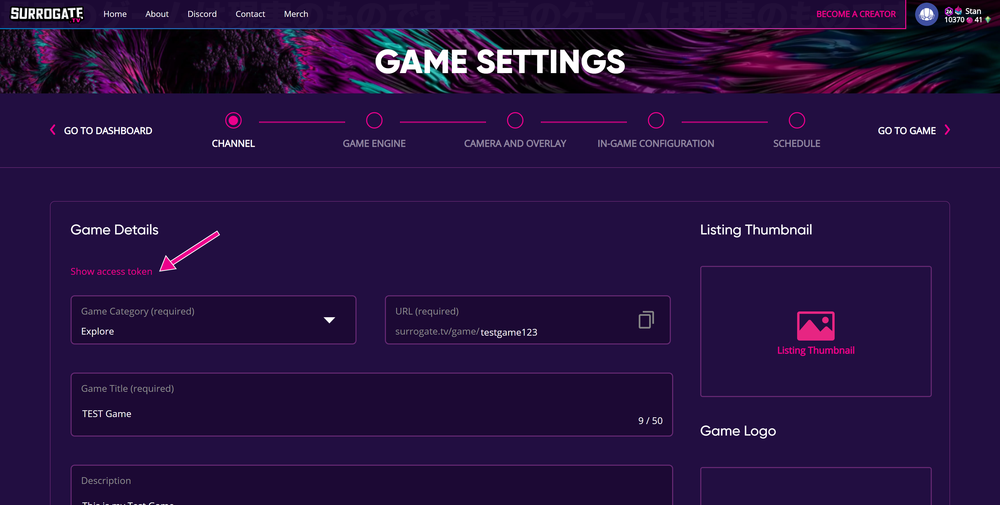

The configuration file is used both by the streamer and the controller. You need
sudo privileges to edit the file. **Note: you will need to restart all programs
using these configurations to activate the changes**

You can restart the streamer systemd module by running:

```
sudo systemctl restart srtg
```

Here is how your config file should look like. If you are using USB camera the
`[sources.videoparams] -> type` should be `"v4l2"` and if you are using raspi
camera it should be `"rpi_csi"`.

```toml
device_id = "<INSERT CONTROLLER NAME HERE>"

[game_engine]
url = "https://ge.surrogate.tv/signaling"

token = "<INSERT CONTROLLER TOKEN HERE>"

[rtc_config]
[[rtc_config.ice_servers]]
urls = "stun:stun.l.google.com:19302,stun:stun1.l.google.com:19302,stun:stun2.l.google.com:19302,stun:stun3.l.google.com:19302,stun:stun4.l.google.com:19302"

[[sources]]
kind = "video"
label = "main"

[sources.video_params]
# Possible values for type: v4l2, h264_passthrough, rpi_csi
type = "v4l2"
width = 1280
height = 720
framerate = 30
v4l2_encoded_loopback_dev = 20
# Optional, used to specify which camera to use if you have multiple cameras connected
#v4l2_dev = "path to your video device: /dev/videoX"
# Optional capture format: raw, mjpeg. Defaults to mjpeg or available one
#capture_format = mjpeg

# Audio, optional. This will enable audio if you have an audio capture device connected.
# The default alsa device will be used, unless a specific device is chosen with the
# additional audio parameters below.
#[[sources]]
#kind = "audio"
#label = "main"

# Optional parameter to set the default audio capture device. NOTE: only one audio capture
# device can be specified at a time. The [[sources]] audio parameter must also be set.
#[sources.audio_params]
#audio_capture_dev_name = "C925e"
# Optional - default value is 0
#audio_capture_dev_idx = 1

```

To get a list of available cameras you can run the following command (you may
have to install v4l-utils: (`sudo apt install v4l-utils`)):

```
sudo v4l2-ctl --list-devices
```

If you want to know what resolutions and formats your `usb camera` supports, run:

```
v4l2-utils -d /dev/video<ID> --list-formats-ext
```

<details>
  <summary>**Choosing audio capture device (advanced)**</summary>

**WARNING:** this will overwrite your `/etc/asound.conf` file.
A backup will be saved, however.

If you have multiple audio capture devices (aka "cards" in alsa parlance) and
wish to specify which one is used, you can find a list of available devices with
the following command:

```
sudo arecord --list-devices
```

The output will look something like this:

```
**** List of CAPTURE Hardware Devices ****
card 1: webcam [Full HD webcam], device 0: USB Audio [USB Audio]
  Subdevices: 1/1
  Subdevice #0: subdevice #0
card 2: C925e [Logitech Webcam C925e], device 0: USB Audio [USB Audio]
  Subdevices: 1/1
  Subdevice #0: subdevice #0
```

To choose the second device on the list, you must add the string after `card 2:`
to the config file:

```
[sources.audio_params]
audio_capture_dev_name = "C925e"
```

**Beta feature:** If you have an audio capture card with multiple devices, you
can specify which device to use by also adding the device number to the config
file:

```
[sources.audio_params]
audio_capture_dev_name = "C925e"
audio_capture_dev_idx = 1
```

</details>

#### Adding your controller to the game

Now that your controller has the correct configuration file, we can add the controller
to the game page. Go to the Game Settings -> Game Engine section to add a new controller.

The streamer tries to automatically add the correct controller information to the
Game Settings once it's started, so you might already see a controller with the
device_id specified in [configuration file](#configuration-file). If this is the
case, just set the controller to "Enabled".

If, however, no controller is found on the Game Settings page, use the previously
defined device_id for the ID and Streamer fields. For the Queue Id, Seat, and Set
use "0" as a temporary input (you can edit these fields later) and set the controller
as "Enabled."

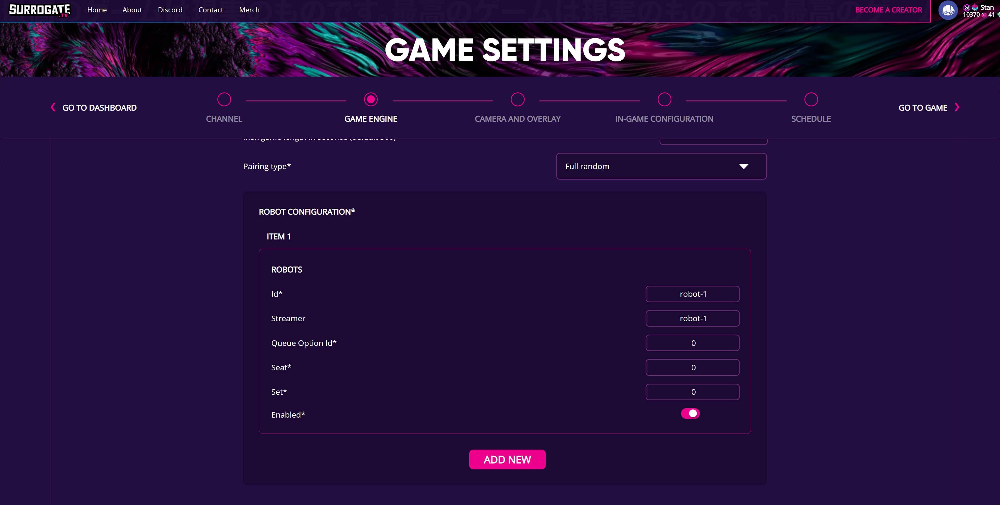

To test that the controller is connected correctly and the streamer is working,
go to the game dashboard page and scroll down. You should be able to see your
controller in the "Sets" section of the page. If the streamer is shown is green,
this means that the camera of your controller is working. You can press the preview
button to see it in action.

#### Running a template game

At this point we should have the `streamer` working if you have a camera connected
and configured properly.

Now that you have everything installed and a game with game settings configured
correctly, we are ready to run the [simple-game-template](custom_game_creation.html#simplegame-template).

For testing we can run the python code manually on the terminal.

```
sudo python3 -m game_templates.simple_game
```

This game creates you a switch and joystick inputs that can be used to control
a device. The inputs must be verified from the Game Settings ->
In-Game Configuration, by pressing the "Save" button below Control Settings.
After saving the settings, you should be able to test the inputs from the admin
panel preview.

**Note: if you want your code to run constantly and start automatically after boot,
you should setup a systemd unit [this way](#running-the-surrortg-python-sdk-controller-automatically-on-boot).**
Now you are ready to move to beginner friendly [ready to run examples](ready_games),
or to more advanced [game development](game_development), where we explain in
detail how the games work!

#### Running the SurroRTG Python SDK (controller) automatically on boot

To make the python code automatically start after restarting the raspberry pi,
you will need to follow the steps here to do so. Below are the example contents
of the existing `controller-rpi.service` file that is located in the sdk `scripts`
folder. You will need to make sure that the following options are correct:
`WorkingDirectory` has absolute path to your sdk root folder, and `Environment=GAME_MODULE=`
has the correct python path inside the sdk folder.

```
[Unit]
Description=Surrogate robot control software
After=network.target pigpiod.service
Wants=pigpiod.service
StartLimitIntervalSec=0
[Service]
Type=simple
Restart=always
RestartSec=10
Environment=GAME_MODULE=game_templates.simple_game
WorkingDirectory=/home/pi/surrortg-sdk
ExecStart=/usr/bin/python3 -m $GAME_MODULE
[Install]
WantedBy=multi-user.target
```

Then run the `setup-systemd.sh` script (located in `scripts` folder) to update
and reload your new systemd module. If you have already created the systemd unit
and you have not changed the file you are running (GAME_MODULE), you can just
reload the systemd unit with

```
sudo systemctl restart controller
```

For instructions on how to control systemd units, see [troubleshooting page](troubleshooting)

#### Installing Surrogate Watcher Stream

Wacther stream is a stream that is visible to the viewers when the game is online.
The stream is a copy of the game stream, and requires that you have finished
[installing the streamer](#installing-surrogate-streamer) before following these
steps.

Setting up watcher stream has only 2 steps. First, install the apt-package by running:

```
sudo apt install srtg-watcherstream
```

After installation, toggle the stream on from your game admin dashboard. You
should see the video stream on the game page after a short delay.

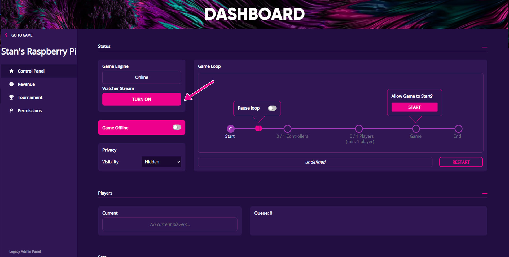

The watcherview components creates a systemd unit `srtg-watcherstream`, which
you can [control](#controlling-systemd-units) similarly to other systemd units.
