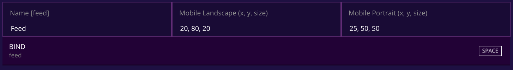

# Dog feeder

This game implementation was used as part of the 30.4.2021 lets do this event.
In the event players where able to feed dogs using a DIY dog feeder
device made with servo, cartboard tube and lid of a plastic can.

You can check the full event from the
[surrogate.tv youtube channel](https://www.youtube.com/watch?v=wPxVsZT8h8Q).

## HW

The feeding device was made with cartboard tube (full of dog treats)
mounted on top of a lid of a plastic can.
The lid was connected to a servo and was positioned so that
it blocked the end of the cartboard tube.
When user wanted to feed the dogs the servo is fastly moved back and forth
to release small amount of dog treats.
The servo is connected to raspberry pi and is controlled by
the game implementation in the [game.py](/games/dog_feeder/game.py).


## The game implementation

The main functionality of the game is to move the servo back and forth on user action.
There is couple of existing classes in our SDK to help us create this effect:

- [Switch](/surrortg/inputs/switch.py) allows us to run code
  when user presses a key or button on mobile
- [Servo](/surrortg/devices/servo.py) allows us to easily control
  a servo between given min_pulse_width and max_pulse_width (the angle of the servo)
- [Game](/surrortg/game.py) can be used to react to different states
  of the game loop

### DogFeederGame

The `DogFeederGame` is running the main loop of the game.
You can find the full implementation from [game.py](/games/dog_feeder/game.py).

In the `on_init` method we:

- Create a instance of Servo class with with configuration
  (`SERVO_MIN_PULSE_WIDTH`, `SERVO_MAX_PULSE_WIDTH`, etc)
  coming from [config.py](/games/dog_feeder/config.py).
- Rotate the servo initially to position 1 (=`SERVO_MAX_PULSE_WIDTH`).
- Crete and register `ServoSwitch` input

Note: Registered inputs appear in admin panel where you can configure the bindings


In the `on_pre_game` we make sure the servo is always in the position that
blocks the treats from dropping at the start of the game (position 1).

In the `on_finish` we send score 1. This is done since the games `Score type` is
set to `Total Games` from the admin panel.
Only games with end result of 1 are calculated as validly finished game in
this mode.


### ServoSwitch

The `ServoSwitch` moves the servo back and forth on user input.
You can find the full implementation from [game.py](/games/dog_feeder/game.py).

Movement it performed in the `on` method by

```
await self.servo.rotate_to(-1)
await asyncio.sleep(0.1)
await self.servo.rotate_to(1)
```

The `ServoSwitch` class also has `max_presses` parameter to limit the amount of
feeding times per game. It is set from config `MAX_FEED_PER_GAME` when
`ServoSwitch` is created.

### config.py

The [config.py](/games/dog_feeder/config.py) contains settings related to game play
experience and the servo configuration

Note: The game is implemented so that `SERVO_MAX_PULSE_WIDTH` is the servo pulse
width for position where the lid should block the dog treats from dropping and
`SERVO_MIN_PULSE_WIDTH` defines the range of back and forth movement to drop treats.
You can find the right values for `SERVO_MIN_PULSE_WIDTH` and `SERVO_MAX_PULSE_WIDTH`
for your physical setup with changing the value and testing the game by
trial and error.

## Links

- Start creating your own game at [surrogate.tv/creators](https://www.surrogate.tv/creators?utm_source=github&utm_medium=text-link&utm_campaign=exp_dog-event&utm_content=readme)
- Servo tutorial (coming soon)
- Surrogate.tv documentation [docs.surrogate.tv](https://docs.surrogate.tv)
- [The full event video](https://www.youtube.com/watch?v=wPxVsZT8h8Q)
- [Build livestream day 1](https://www.youtube.com/watch?v=cSH8jqlPPzM)
- [Build livestream day 2](https://www.youtube.com/watch?v=0UuOZVga4Es)
- [Build livestream day 3](https://www.youtube.com/watch?v=X9fc11Vds_g)
