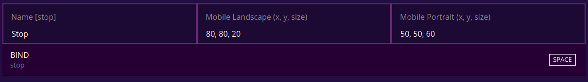
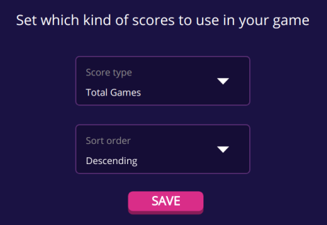

# Fortune wheel

This game implementation was used as part of the 7.5.2021 lets do this event.
In the event players were able to use a fortune wheel to select dares to be
performed by the show hosts.

You can check the full event from the
[surrogate.tv youtube channel](https://www.youtube.com/watch?v=r2OCeeN6TRk).

## Hardware

The wheel was made out of circular wood slap with printed dares
that was mounted on tripod.
We wanted to give the players maximum control over where the wheel
would land so unlike a normal fortune wheel our wheel would stop
immediately on user action.
The stopper was done by attaching a wooden stick to a servo on the
top of the wheel. The stick was moved up and down during the
game loop by the servo.
The servo is connected to Raspberry Pi and is controlled by
the game implementation in the [game.py](/games/fortune_wheel/game.py).

## The game implementation

The main functionality of the game is to move the stopper up at the beginning
of the game and back down on user action.
There is couple of existing classes in our SDK to help us create this functionality:

- [Switch](/surrortg/inputs/switch.py) allows us to run code
  when user presses or releases a key or button on mobile
- [Servo](/surrortg/devices/servo.py) allows us to easily control
  the angle of the servo between given min_pulse_width and max_pulse_width
- [Game](/surrortg/game.py) can be used to react to different states
  of the game loop

### FortuneWheelGame

The `FortuneWheelGame` is running the main loop of the game.
You can find the full implementation from [game.py](/games/fortune_wheel/game.py).

**In the `on_init` method we**:

- Create a instance of Servo class with with configuration
  (`SERVO_MIN_PULSE_WIDTH`, `SERVO_MAX_PULSE_WIDTH`, etc)
  coming from [config.py](/games/fortune_wheel/config.py).
- Rotate the servo initially to position -1 (=`SERVO_MIN_PULSE_WIDTH`).
- Crete and register `ServoSwitch` input

Note: Registered inputs appear in admin panel where you can configure the bindings

**In the `on_prepare` method we** return false to make sure the game loop
doesn't start automatically.
This gives us manual control to let the next person in to the game by clicking
"Allow Game to Start?" button from the admin panel.

**In the `on_pre_game` method we** move the servo to position 1 witch
allows the wheel to spin.

**In the `stop_cb` method we** send score 1. This is done since the games
`Score type` is set to `Total Games` from the admin panel.
Only games with end result of 1 are calculated as a valid finished game in
this mode.
We also set the `final_score` to true witch will end the game for current
player.

### ServoSwitch

The `ServoSwitch` moves the stopper back down on user input.
This is done by setting the servo to position -1.
You can find the full implementation from [game.py](/games/fortune_wheel/game.py).

The `ServoSwitch` class also has `stop_cb` parameter that is called after the
stopper is moved down.
Note that the `FortuneWheelGame` implementation uses this parameter to end the
game for current player.

### config.py

The [config.py](/games/fortune_wheel/config.py) contains settings related to
the servo configuration

Note: The game is implemented so that `SERVO_MIN_PULSE_WIDTH` is the servo pulse
width for angle where the stopper should allow the wheel to spin and
`SERVO_MAX_PULSE_WIDTH` is the angle where stopper should be down blocking the
wheel from spinning.
You can find the right values for `SERVO_MIN_PULSE_WIDTH` and `SERVO_MAX_PULSE_WIDTH`
for your physical setup with changing the value and testing the game by
trial and error.

## Links

- Start creating your own game at [surrogate.tv/creators](https://www.surrogate.tv/creators?utm_source=github&utm_medium=text-link&utm_campaign=exp_fortune-wheel-event&utm_content=readme)
- Servo tutorial (coming soon)
- Surrogate.tv documentation [docs.surrogate.tv](https://docs.surrogate.tv)
- [The full event video](https://www.youtube.com/watch?v=r2OCeeN6TRk)
- [Build video](https://www.youtube.com/watch?v=LCwQatznBQA)
